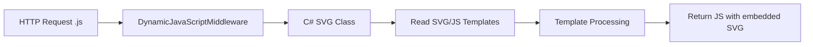

# SaVaGe - Dynamic SVG Service Documentation

## Overview

SaVaGe (named after Augusta Savage and containing "SVG") is a C# Blazor server application that dynamically generates and serves SVG graphics as JavaScript files. The service provides a unique approach to creating programmatically-generated SVG content with both server-side (C#) and client-side (JavaScript) processing capabilities.

## Architecture

### Core Flow



### Key Components

1. **DynamicJavaScriptMiddleware.cs** - Central request router
2. **SVG Component Classes** - C# classes that compose SVG elements
3. **wwwroot Templates** - SVG and JS templates with mustache placeholders
4. **Client-side JS** - IIFEs that inject SVG into DOM

## Request Processing Pattern

### 1. Middleware Routing (DynamicJavaScriptMiddleware.cs)

The middleware intercepts `.js` requests and routes them to appropriate SVG generator classes:

- `/button.js` → ButtonSVG class
- `/form.js` → Form class (note: misnamed as Shield internally)
- `/parent-container.js` → ParentContainer class
- `/svg-pes-*` → SVGParticleEmitter with dynamic emitter selection
- Query parameters are extracted and passed to generators

### 2. SVG Component Classes

Located in `/Middleware/SVGs/` and `/Middleware/SVGElements/`

Pattern:
```csharp
internal async Task<string> SVG(string wrapper, IWebHostEnvironment _env) 
{
    // 1. Read template files from wwwroot
    var svg = await _env.ReadFileFromWebRootAsync("path/to/template.svg");
    var js = await _env.ReadFileFromWebRootAsync("path/to/template.js");
    
    // 2. Process mustache templates
    svg = svg.Replace("{{placeholder}}", value);
    
    // 3. Compose multiple SVG components if needed
    
    // 4. Embed SVG into JS wrapper
    return wrapper.Replace("{{contents}}", svg);
}
```

### 3. Template System

Two types of mustache templating:
- **Double mustache `{{value}}`** - Server-side (C#) replacement
- **Single mustache `{value}`** - Client-side (JavaScript) replacement

## Directory Structure

```
/Middleware/
├── DynamicJavaScriptMiddleware.cs  # Main request handler
├── SVGElements/                    # Individual SVG components
│   ├── Button.cs
│   ├── Form.cs (misnamed as Shield)
│   ├── Text.cs
│   └── ...
├── SVGs/                           # Composite SVG generators
│   ├── OSFLogo.cs
│   ├── ButtonSVG.cs
│   └── ...
└── SVGContainers/                  # Container components
    ├── Parent.cs
    ├── Background.cs
    └── ...

/wwwroot/
├── ui/                             # Base UI components
│   ├── button/
│   │   ├── button.svg             # SVG template
│   │   └── button.js              # JS wrapper
│   └── ...
├── containers/                     # Container templates
│   ├── forms/
│   │   └── the-form-engine.js    # Dynamic form generator
│   └── ...
├── logos/                         # Logo components
├── effects/                       # Visual effects
└── animations/                    # SVG animations
```

## Component Types

### 1. Simple Components (Button example)

**Button.cs**: Reads SVG template, replaces placeholders
**ButtonSVG.cs**: Adds JS wrapper, handles click events
**button.svg**: SVG template with `{{buttonText}}` placeholder
**button.js**: IIFE that injects SVG and adds event listeners

### 2. Complex Components (Form Engine)

**the-form-engine.js**: 
- Generates complete SVG forms from JSON
- Uses `foreignObject` to embed HTML inputs in SVG
- Handles gradients, animations, and interactions
- Pattern: `getForm(formJSON, onSubmit)`

### 3. Particle Emitters

**SVGParticleEmitter.cs**: 
- Dynamically loads emitter configurations from JSON
- URL pattern: `/svg-pes-[emitterName].js`
- Supports position parameters via query string

## Special Features

### Dynamic JavaScript Serving
- All components served as JavaScript files
- No static file serving - everything generated on request
- Supports query parameters for customization

### Composite Components
Components can compose other components:
```csharp
var shield = new Shield();
var shieldSVG = await shield.Text(_env);
var lightning = new Lightning();
var bolt = await lightning.Bolt(...);
// Combine multiple SVG elements
```

### Form Engine
Advanced form generator that:
- Creates metallic-styled forms entirely in SVG
- Embeds HTML inputs using `foreignObject`
- Handles animations and gradient effects
- Collects and returns form data via callback

## Usage Pattern

1. **Request**: Client requests `/button.js?text=Click%20Me`
2. **Route**: Middleware routes to ButtonSVG class
3. **Process**: Class reads templates, processes parameters
4. **Compose**: Multiple SVG elements combined if needed
5. **Wrap**: SVG embedded in JavaScript IIFE
6. **Return**: JavaScript file with embedded SVG
7. **Execute**: Client runs JS, SVG injected into DOM

## Key Observations

- **No Traditional Routing**: Uses switch statement in middleware
- **Template-Driven**: Heavy use of file templates with placeholders
- **JavaScript Delivery**: All SVG served as executable JavaScript
- **Component Composition**: Classes can compose multiple SVG elements
- **Query Parameter Support**: Dynamic customization via URL parameters
- **Form.cs Bug**: The Form class is incorrectly declaring itself as Shield class

## Development Notes

- Add new components by creating class in `/Middleware/` and templates in `/wwwroot/`
- Follow IIFE pattern for JavaScript wrappers
- Use double mustache for server-side, single for client-side replacements
- Component classes should implement `SVG()` method returning processed string
- Extension method `ReadFileFromWebRootAsync()` simplifies file reading