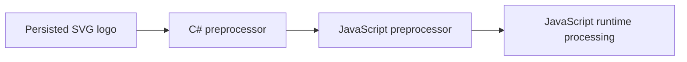

# SaVaGe

* SaVaGe (named for [Augusta Savage][augusta], an American artist associated with the Harlem Rennaisance; the fact that it contains the letters [SVG][ht1], and the fact that SaVaGe is a dope name for something), is a repo for collecting useful drawing abstractions, _in code_, for use by SVGs on the web, and anywhere else that SVGs might show up. 

The initial purpose of this repo is to build a logo for [Open Source Force][osf].
If you don't see a really cool logo in this README, it means we haven't finished it yet.

## Overview

Scalable Vector Graphics are xml documents that implement a drawing API to draw images into your browser.
In general they are used for simpler graphics where things like dithering aren't as important.
This is because for _most_ people who care about graphical things, making them with a graphical program is easier than learning the SVG spec, and writing a bunch of drawing instructions in xml.

I am not one of those people.

I can't draw my way out of a paper bag.
What I can do is figure out how to turn pixels on and off in pretty much any programming language folks can dream up, and then create a series of increasingly complicated abstractions in order to get a cat drawing on the screen.

I will literally recreate the laws of Physics in code before trying to draw with a stylus anywhere. 

So it's been on my list of things to do to look at SVG, and Lottie, to see if either or both could be used to update with code to make logos. 
I was expecting it to be a bunch of unreadable gobbledy-gook full of one letter properties and whatnot, and I was not let down. 
But after spending an evening reading through the [MDN SVG Tutorial][mdn], I'm more convinced than ever that coding up a logo is more feasible than trying to draw one, and so here we are.

## The Repo

After talking with Wick3d, we landed on using Blazor and thus C# for this project. 
For one it seems to be one of the least polarizing languages on the server, and for two, Microsoft can afford to pay technical writers to make their docs, a useful property for any project trying to reach a group of different language programmers.

To start, the two files we care about are `Components/App.cs` and `wwwroot/osf-logo.js`. 

`App.cs` is the Blazor web app that gets served. 
Its main action happens in the Routes folder, which I've removed for now.
But we can add things to this app to make SVG editing easier... or not, if we only use Blazor to test the SVG and serve it up, that'd be sufficient.

`wwwroot/osf-logo.js` is the js file we'll want to use to have the logo render on a webpage. 
Right now, a placeholder svg is hardcoded in the file to show the basics of how this works, but we can use both C#, and JavaScript to do interesting stuff before, and while the logo is rendered. 
This creates a possible graphics pipeline that looks like this:

What could we do with all that?
I really don't know, lol. 
Maybe C# hits some weather API, and if it's raining then it's raining on the logo.
Then the JS preprocessor could grab accent colors from the receiving site and highlight them in the logo.
And then maybe the logo's on fire.

## Contributing

The flowchart above takes place in code as follows:

`Middleware/DynamicJavaScriptMiddleware.cs` receives a request for a SaVaGe element. 
That request gets sent to the appropriate class in `Middleware/SVGs`. 
That class puts together the svg and js files in wwwroot, and the middleware returns it back to the client.

The wwwroot dir has the following structure:

├── animations            // these are specifically svg animations that can be added to components
├── bootstrap             // leftover from the original blazor app
├── containers            // these are backgrounds and/or layers for holding svgs
│   ├── backgrounds       // backgrounds
│   ├── parent            // this container fills its parent container
│   └── webpage           // this container is the body element of a webpage
├── effects               // special effects like sparkles and lightning bolts
├── game-scene            // building towards a whole layered game scene 
├── logos                 // logos for use like the Open Source Force logo
│   ├── osf-logo          // Open Source Force logo
│   ├── planet-nine-logo  // Planet Nine logo
│   └── savage-logo       // SaVaGe logo
├── planet's-test-dir     // feel free to make your own test dir for trying things out
└── ui                    // base ui elements
    ├── button            // button, the onclick handling is a bit awkward right now
    ├── image             // image
    ├── link              // a wrapper that can turn any svg into a link
    └── text              // text

If you have never made SVG via code, which is likely because I don't think people really do that, please read this [primer][primer].

There are two types of components: js and svg. 
js components are meant to be served by the blazor server after being composed.
svg components are the pieces of svg composed into the js.

#### Adding an svg component

svg components will always be wrapped in svg tags. 
svg can have svg in it so you can wrap your component in svg or not.
If you don't it'll be appended wherever in the svg dom it gets added during composition.

In the svg, we use mustache templating for interpolated values.
A double mustache {{replacementString}} is for values inserted by the server via C#.
A single mustache {replacementString} is for values inserted by javascript.

#### Adding a js component

js components are IIFEs that will add themselves to the dom.
If an html element with the correct id exists, it'll add the svg as a child to that element. 
js components are what get served from the SaVaGe server.

To add to this repo, feel free to make a [pull request][pr].

## Totally optional history section

I just so happened to be in fifth grade during the very brief period where American schools had the budget to purchase computers, but there wasn't the internet, and thus a whole lot of things that were interesting to do on them.
To keep kids entertained on the glowing black and green boxes, teachers turned to a humble turtle.

[Logo][logo] is a programming language developed in 1967. 
While it does a whole lot more than just move a turtle, most people's engagement with the language was through turtle graphics--a drawing program where you programmed instructions to move the turtle around and draw.

I would've programmed that turtle forever if I could.

25 years later I would give a talk at a conference about just how much more difficult it is to get into programming. 
To make my point here, I went to go check CodeAcademy and saw that most of their content is now paid. 
So there you go, got to sink money into a website just for them to make you feel stupid for not knowing what an array is.

All this is to say I have a special place in my heart for drawing APIs. 
When you're ten, moving around a turtle to draw is right in line with your priorities.
npm installing 50 dependencies, and adding a transpiler, and downloading an ide, and... well all that business is not.

[augusta]: https://en.wikipedia.org/wiki/Augusta_Savage
[osf]: https://opensourceforce.net
[mdn]: https://developer.mozilla.org/en-US/docs/Web/SVG/Tutorial
[pr]: https://github.com/opensource-force/savage/pulls
[logo]: https://en.wikipedia.org/wiki/Logo_(programming_language)
[primer]: https://developer.mozilla.org/en-US/docs/Web/SVG/Tutorial/Introduction

[ht1]: ## "Scalable Vector Graphics, an image format for the web."
